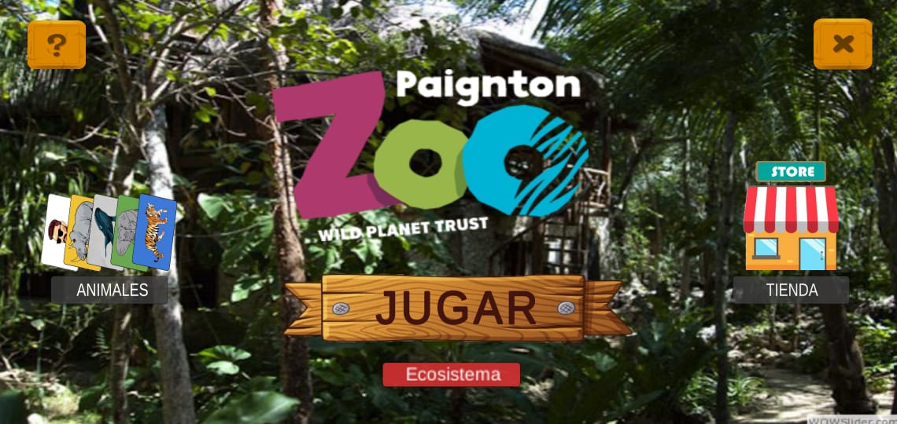
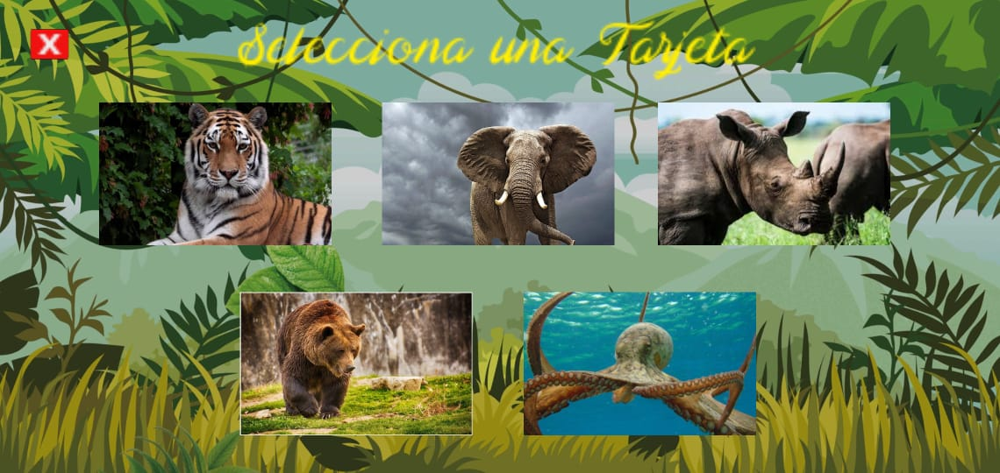
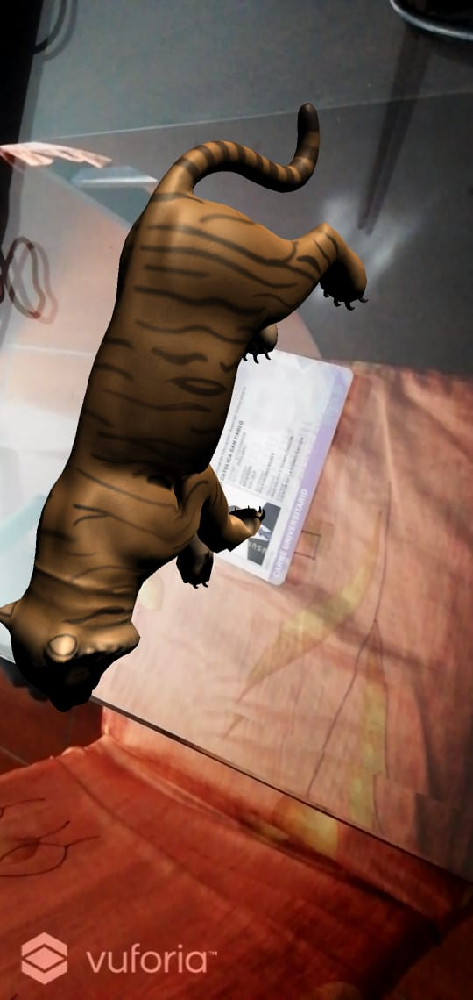
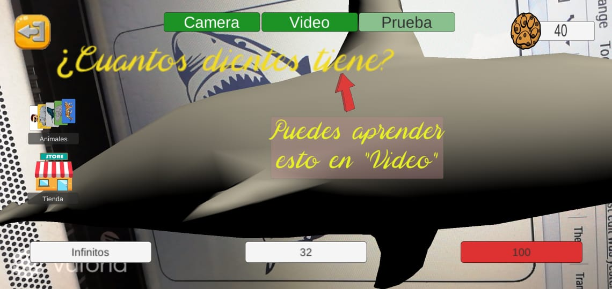
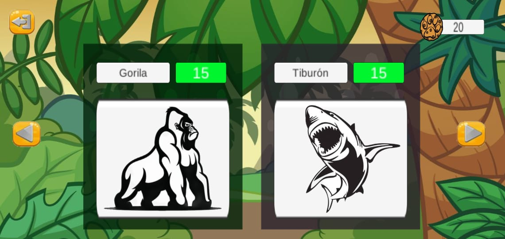
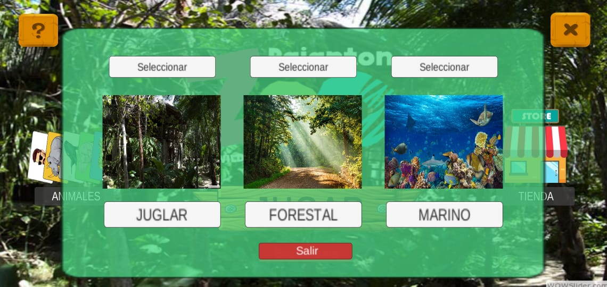

# Zoo 3D

### Enlace para descargar el APK :

### Enlace de la tienda virtual : 
[Enlace Tienda Online](http://zoo3dwebpage.s3-website-us-east-1.amazonaws.com/)

### Enlace Video Demostración : 
[Enlace Video YouTube](https://www.youtube.com/watch?v=vQUtKVUX3gk)

### Curso Iteracción Humano Computador

Proyecto de creación de un Zoológico 3D con realidad aumentada (AR)

## Información sobre los animales
Datos sobre los animales que te ayudarán a responder preguntas

## Presentción animales en AR
Con el fin de conocer al animal físicamente desde tu celular

## Cuestionario sobre animales
Refuerza el conocimiento sobre los animales
Además de adquirir recompensa por reponder bien

## Tienda virtual 
Con el fin de adquirir más animales

## Diferentes ecosistemas de animales
Desbloquea ecosistemas con forme obtengas más cartas

